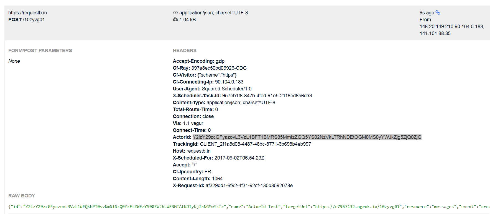

# Load Balancing Affinity for Cisco Spark Bots

A reverse proxy that:
- looks for the actorId in a Cisco Spark Webhook event
- injects it as an 'Actorid' HTTP header 
- then forwards the incoming POST request to a target URL (generally a cluster of Cisco Spark Bots sitting behind a load balancer)

The typical use case is to enable Load Balancing affinity for cisco Spark bots, based on the PersonId of the users interacting with the bot.


## How to use

The proxy reads the Load Balancer endpoint via the TARGET_URL env variable.

**Instructions on Mac/Linux**
```shell
git clone https://github.com/ObjectIsAdvantag/webhook-affinity
cd webhook-affinity
npm install
DEBUG=injector TARGET_URL=https://your-bot-server node server.js
```

**Instructions on Windows**
```shell
git clone https://github.com/ObjectIsAdvantag/webhook-affinity
cd webhook-affinity
npm install
set TARGET_URL=https://your-bot-server
set DEBUG=injector
node server.js
```

## Seeing the proxy at work from your local machine

- Create a [test endpoint](https://requestb.in) where we'll receive Cisco Spark webhook notifications, enriched with the 'Actorid' Header.
   - Example: https://requestb.in/10zyvg01

- Run the proxy on your local machine with Requestb.in as the destination endpoint. 
   - Make sure you specify https://requestb.in and not the full path to your requestb.in endpoint (ie, no suffix, as show below)
   
   ```shell
   TARGET_URL=https://requestb.in  node server.js
   ```

- Expose the proxy via ngrok.
   
   ```shell
   ngrok http 9090
   ```

- Create a Webhook for (Messages/Created) events with name "Actorid Injection Test" from a Bot Account token and pointing to the ngrok URL, suffixed with your requestb.in identifier. 
   - Example: https://e7957132.ngrok.io/10zyvg01
   
   

- Now interact with the bot in a Cisco Spark space and check the enriched JSON payload at requestb.in's inspect URL. 
   - Example: https://requestb.in/10zyvg01?inspect
   
   


## Architecture

Cisco Spark webhooks send notification events via POST requests, with the [JSON payload documented here](https://developer.ciscospark.com/webhooks-explained.html#handling-requests-from-spark).

In order to maintain affinity to a bot instance, the actorId property is extracted from the JSON webhook notification example below, and injected as an extra HTTP header named: "ActorId".

```json
{
  "id":"Y2lzY29zcGFyazovL3VzL1dFQkhPT0svZjRlNjA1NjAtNjYwMi00ZmIwLWEyNWEtOTQ5ODgxNjA5NDk3",
  "name":"Guild Chat to http://requestb.in/1jw0w3x1",
  "resource":"messages",
  "event":"created",
  "filter":"roomId=Y2lzY29zcGFyazovL3VzL1JPT00vY2RlMWRkNDAtMmYwZC0xMWU1LWJhOWMtN2I2NTU2ZDIyMDdi",
  "orgId": "Y2lzY29zcGFyazovL3VzL09SR0FOSVpBVElPTi8xZWI2NWZkZi05NjQzLTQxN2YtOTk3NC1hZDcyY2FlMGUxMGY",
  "createdBy": "Y2lzY29zcGFyazovL3VzL1BFT1BMRS8xZjdkZTVjYi04NTYxLTQ2NzEtYmMwMy1iYzk3NDMxNDQ0MmQ",
  "appId": "Y2lzY29zcGFyazovL3VzL0FQUExJQ0FUSU9OL0MyNzljYjMwYzAyOTE4MGJiNGJkYWViYjA2MWI3OTY1Y2RhMzliNjAyOTdjODUwM2YyNjZhYmY2NmM5OTllYzFm",
  "ownedBy": "creator",
  "status": "active",
  "actorId": "Y2lzY29zcGFyazovL3VzL1BFT1BMRS8xZjdkZTVjYi04NTYxLTQ2NzEtYmMwMy1iYzk3NDMxNDQ0MmQ",
  "data":{
    "id":"Y2lzY29zcGFyazovL3VzL01FU1NBR0UvMzIzZWUyZjAtOWFhZC0xMWU1LTg1YmYtMWRhZjhkNDJlZjlj",
    "roomId":"Y2lzY29zcGFyazovL3VzL1JPT00vY2RlMWRkNDAtMmYwZC0xMWU1LWJhOWMtN2I2NTU2ZDIyMDdi",
    "personId":"Y2lzY29zcGFyazovL3VzL1BFT1BMRS9lM2EyNjA4OC1hNmRiLTQxZjgtOTliMC1hNTEyMzkyYzAwOTg",
    "personEmail":"person@example.com",
    "created":"2015-12-04T17:33:56.767Z"
  }
}
``` 
